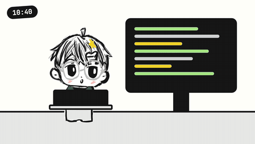
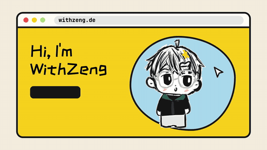

<b>English</b> · <a href="./README.zh-CN.md">简体中文</a>

### Hey there ✦

I'm WithZeng. Mornings at my internship, afternoons back in class, evenings building small things I actually use.
The doodle with round glasses and a stubborn tuft of hair is me. Over on [my site](https://withzeng.de), its eyes follow your cursor.

- 🛠️ Lately: small helpers for my own day-to-day, a few side projects on Cloudflare, an ink-wash dashboard theme
- 🎬 For fun: turning my day into a one-minute cartoon, drawn by hand and animated with code
- 📫 Say hi: [withzengx@gmail.com](mailto:withzengx@gmail.com)

---

### Things I've made

| Project | What it is | Built with |
| --- | --- | --- |
| [**cfsm-theme-withzeng**](https://github.com/WithZeng/cfsm-theme-withzeng) | An ink-wash theme for CF-Server-Monitor, inspired by the novel *Sword of Coming* | TypeScript · Cloudflare |
| [**metallography-image-classification**](https://github.com/WithZeng/metallography-image-classification) | Telling metals apart by their structure under a microscope | Python |
| [**ai-bill-tracker**](https://github.com/WithZeng/ai-bill-tracke) | An Android app that keeps track of where my money goes | Python · Android |
| [**withzeng.de**](https://withzeng.de) | My corner of the internet, hand-drawn and a bit wiggly | Astro · Cloudflare |

### Little cartoons of my days

I draw myself by hand, then animate it with code. One minute each, captions in Chinese.

| [EP01 · A day as WithZeng](https://withzeng.de/shorts/ep01/) | [EP02 · Drawing myself into a website](https://withzeng.de/shorts/ep02/) |
| :---: | :---: |
|  |  |
| Wake up, commute, work, hit a bug, fix it, nod off in class, push at midnight. | How this site got made: a doodle, a broken deploy, and a font that was way too big. |

### Tools I reach for

  

### My commits, eaten by a snake

<picture>
  <source media="(prefers-color-scheme: dark)" srcset="https://raw.githubusercontent.com/WithZeng/WithZeng/output/github-snake-dark.svg" />
  
</picture>
